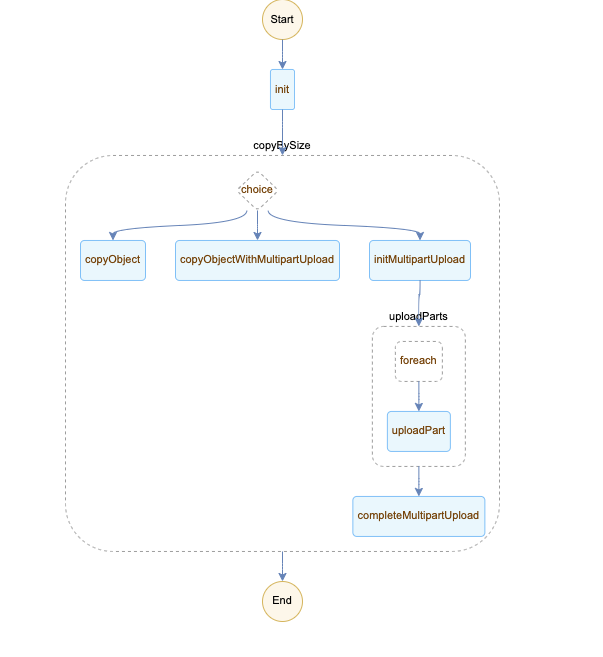

## 简介

本示例演示了如何使用函数工作流从一个 OSS Bucket 复制文件到另一个 Bucket，其中源 Bucket 和目标 Bucket 可以在同一个区域也可以在不同区域。


## 场景

### 增量数据复制
增量数据复制依赖于函数计算的 OSS 触发器，当有新文件上传或者文件更新时，OSS 会触发函数 `startCopyWithFnF`，该函数启动一个 FnF 流程，逻辑如下：
* 如果要复制的文件比较小（比如 50MB 以内），会使用函数 `copyObject` 流式下载文件并上传文件到目标 Bucket。
* 如果要复制的文件比较大（比如 50MB 到 1GB），会使用函数 `copyObjectWithMultipartUpload` 多线程分片下载文件并分片上传到目标 Bucket。
* 如果要复制的文件很大（比如 1GB 以上），会使用三个函数完成复制任务。
    * 第一个函数 `initMultipartUpload` 开始分片上传，并将文件分成 group，每个 group 包含多个分片。
    * 第二个函数 `uploadParts` 处理一个 group 里的多个分片，采用多线程复制分片。该函数的多个实例会并行处理所有 group。
    * 第三个函数 `completeMultipartUpload` 完成分片上传。

其中文件大小阈值可以根据具体情况配置，原则是函数执行不超过最长执行时间限制（10分钟）。
* 同区域复制延迟低，文件大小阈值可以适当调大。
* 跨区域复制延迟高，文件大小阈值可以适当调小。



**相关配置**
* OSS 触发器配置由 Funcraft template 配置，指定了源 Bucket。
* 目的 Bucket `dst_bucket` 由 `startCopyWithFnF` 函数的环境变量配置
* 源 OSS endpoint `src_bucket_endpoint` 和目的 OSS endpoint `dst_bucket_endpoint` 通过函数环境变量配置
* 分片大小 `part_size` 在 FnF 流程定义中配置
* 文件大小阈值 `small_file_limit` `medium_file_limit` 在 FnF 流程定义中配置

**使用步骤**

1. 使用[Funcraft](https://help.aliyun.com/document_detail/64204.html)部署函数

    ```fun deploy -t template.yml```

2. 使用[阿里云 CLI](https://help.aliyun.com/document_detail/122611.html) 创建流程。使用控制台请参见[文档](https://help.aliyun.com/document_detail/124155.html)。流程定义使用[copy-single-object.yaml](./flows/copy-single-object.yaml)。

    ```aliyun fnf CreateFlow --Description "incremental copy" --Type FDL --Name oss-incremental-copy --Definition "$(<./flows/copy-single-object.yaml)" --RoleArn acs:ram::account-id:role/fnf```

3. 使用 ossutil 上传文件到源 Bucket，该文件会被同步到目的 Bucket。

    ```ossutil -e http://oss-cn-hangzhou.aliyuncs.com -i ak -k secret  cp ~/Downloads/testfile oss://hangzhouhangzhou/tbc/```

3. （可选）可以通过直接启动流程复制单个文件：使用[阿里云 CLI](https://help.aliyun.com/document_detail/122611.html) 执行流程。使用控制台请参见[文档](https://help.aliyun.com/document_detail/124156.html)。执行使用下面的输入格式。该输入将会把 `hangzhouhangzhou` bucket 下的 `tbc/Archive.zip` 复制到 `svsvsv` bucket。

    ```aliyun fnf StartExecution --FlowName oss-incremental-copy --Input '{"src_bucket": "hangzhouhangzhou", "dest_bucket": "svsvsv", "key": "tbc/Archive.zip", "total_size": 936771720}' --ExecutionName run1```


### 存量数据复制
存量数据复制流程如下：
`listObjects` 函数通过 OSS ListObjects API 构造文件组，按照文件大小将文件分成 3 组。
* 第一组是小文件。`copyObjects` 函数负责处理多个小文件。每次函数执行处理的所有小文件大小可配置。
* 第二组是大文件。`copyObjectWithMultipartUpload` 函数负责处理大文件。
* 第三组是超大文件。`initMultipartUpload`，`uploadParts`，`completeMultipartUpload` 函数负责处理超大文件。


**使用步骤**

1. 使用[Funcraft](https://help.aliyun.com/document_detail/64204.html)部署函数

    ```fun deploy -t template.yml```

2. 使用[阿里云 CLI](https://help.aliyun.com/document_detail/122611.html) 创建流程。使用控制台请参见[文档](https://help.aliyun.com/document_detail/124155.html)。流程定义使用[copy-multiple-objects.yaml](./flows/copy-multiple-objects.yaml.yaml)。

    ```aliyun fnf CreateFlow --Description "historical copy" --Type FDL --Name oss-historical-copy --Definition "$(<./flows/copy-multiple-objects.yaml)" --RoleArn acs:ram::account-id:role/fnf```

3. 测试复制文件：使用[阿里云 CLI](https://help.aliyun.com/document_detail/122611.html) 执行流程。使用控制台请参见[文档](https://help.aliyun.com/document_detail/124156.html)。执行使用下面的输入格式。该输入将会把 `hangzhouhangzhou` bucket 下的 所有文件复制到 `svsvsv` bucket。

    ```aliyun fnf StartExecution --FlowName oss-historical-copy --Input '{"src_bucket": "hangzhouhangzhou", "dest_bucket": "svsvsv", "prefix": "", "marker": "", "delimiter": ""}' --ExecutionName run1```

## 优势
* 支持任意大小文件的复制。
* 可靠的复制：依赖于函数工作流的重试功能。


## 扩展场景
* 将文件复制到多个区域：只需要修改流程定义添加一个 `foreach` 步骤，对每个区域执行复制逻辑。
* 不受限制解压缩任意大小文件：只需要按照文件大小采用不同的解压方式。
    * 解压后是数量较少的文件
    * 解压后是数量较多的文件

## 优化
* 检查 crc 确保数据的完整性
* 不通过 init 步骤方式配置流程使用常量，减少步骤转换数。